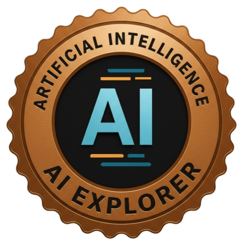
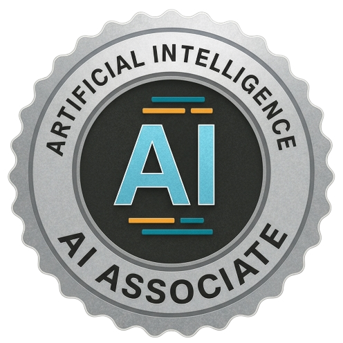
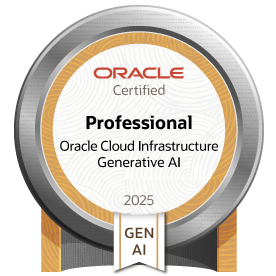

# ADEEL MALIK
**AI/ML Engineer | Full-Stack AI Engineering**  

I design, build, and deploy intelligent systems that turn ideas into scalable, real-world applications. Blending AI research, software engineering, and full-stack development, I focus on creating solutions that are not only accurate, but also production-ready and impactful.  

## Skills  

### Languages  
     

### AI/ML & Data  
     

### MLOps  
      

### Tools  
        

### Visualization  
     

### Others  
    

## Certifications  

&nbsp;&nbsp;

&nbsp;&nbsp;

## What I’m About  
- Turning cutting-edge AI research into **practical applications**  
- Building **end-to-end AI systems** (data → models → APIs → deployment)  
- Open to **collaborations, research, and anything AI**  

## Contact
       
