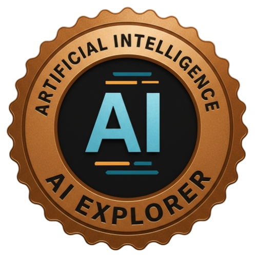
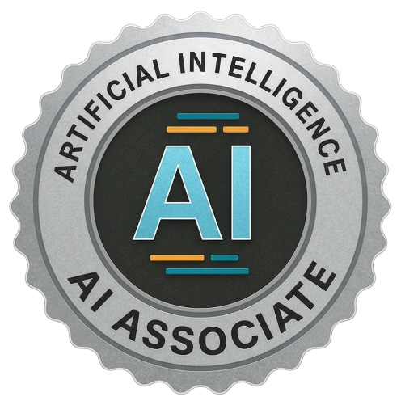
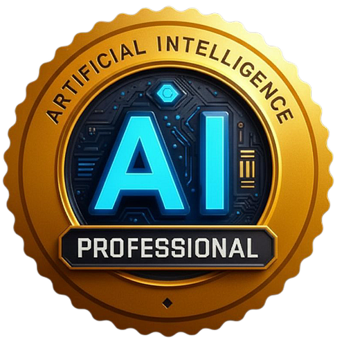
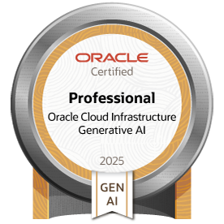
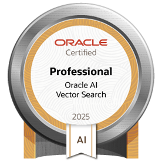

# ADEEL MALIK
**AI/ML Engineer | Edge AI & Computer Vision | Autonomous Systems | Generative AI & RAG**

I design, build, and deploy intelligent systems tailored for defense, aviation, and autonomous robotics. Blending AI research, software engineering, and hardware-accelerated deployment, I focus on creating scalable, real-world applications that operate reliably from the cloud to the edge.

## What I’m About
- Developing **Edge AI & Computer Vision** pipelines (NVIDIA Jetson, Raspberry Pi)
- Building **fully offline RAG architectures** and generative AI workflows
- Researching **sensor fusion, target tracking**, and unsupervised multimodal learning
- Engineering **end-to-end AI systems** (Data → Models → APIs → Hardware Deployment)

## Featured Work
- **[HawkEye](https://github.com/BLShaw/HawkEye):** Edge-AI computer vision platform for real-time drone detection and targeting.
- **[MANTIS](https://github.com/BLShaw/MANTIS):** Fully offline Retrieval-Augmented Generation (RAG) system for technical aviation manuals.
- **[CDZ-TKBA-COIL100](https://github.com/BLShaw/CDZ-TKBA-COIL100):** Unsupervised multimodal decoupled architecture for autonomous real-world agents.

## Skills

### Languages
    

### AI, ML & Computer Vision
     

### Backend, APIs & Databases
    

### Edge AI, MLOps & DevOps
       

### OS & Development Tools
     

### Visualization
   

### Others
  

## Certifications

&nbsp;&nbsp;

&nbsp;&nbsp;

&nbsp;&nbsp;

&nbsp;&nbsp;

